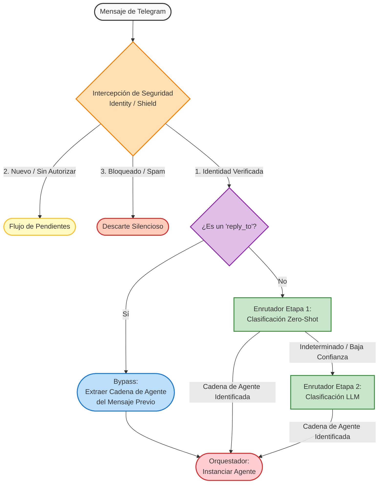

# Full message flow diagram (WIP)

```mermaid
flowchart TD
    %% Punto de entrada y Seguridad
    A([Mensaje de Telegram]) --> B{Intercepción de Seguridad<br/>Identity / Shield}
    
    B -->|2. Nuevo / Sin Autorizar| D([Flujo de Pendientes])
    B -->|3. Bloqueado / Spam| E([Descarte Silencioso])
    
    %% Camino de Identidad Verificada y Evaluación de Contexto
    B -->|1. Identidad Verificada| R{¿Es un 'reply_to'?}
    
    %% El Bypass (Vía Rápida)
    R -->|Sí| BP([Bypass:<br/>Extraer Cadena de Agente<br/>del Mensaje Previo])
    BP --> ORC([Orquestador:<br/>Instanciar Agente])
    
    %% El Enrutador de 2 Etapas
    R -->|No| R1[Enrutador Etapa 1:<br/>Clasificación Zero-Shot]
    
    R1 -->|Indeterminado / Baja Confianza| R2[Enrutador Etapa 2:<br/>Clasificación LLM]
    
    %% Convergencia hacia el Orquestador
    R1 -->|Cadena de Agente Identificada| ORC
    R2 -->|Cadena de Agente Identificada| ORC

    %% Estilos para separar dominios visualmente
    classDef entry fill:#f9f9f9,stroke:#333,stroke-width:2px;
    classDef security fill:#ffe0b2,stroke:#f57c00,stroke-width:2px;
    classDef pending fill:#fff9c4,stroke:#fbc02d,stroke-width:2px;
    classDef rejected fill:#ffccbc,stroke:#d32f2f,stroke-width:2px;
    classDef decision fill:#e1bee7,stroke:#8e24aa,stroke-width:2px;
    classDef process fill:#c8e6c9,stroke:#388e3c,stroke-width:2px;
    classDef bypass fill:#bbdefb,stroke:#1976d2,stroke-width:2px;
    classDef core fill:#ffcdd2,stroke:#d32f2f,stroke-width:2px;

    class A entry;
    class B security;
    class D pending;
    class E rejected;
    class R decision;
    class R1,R2 process;
    class BP bypass;
    class ORC core;
```

