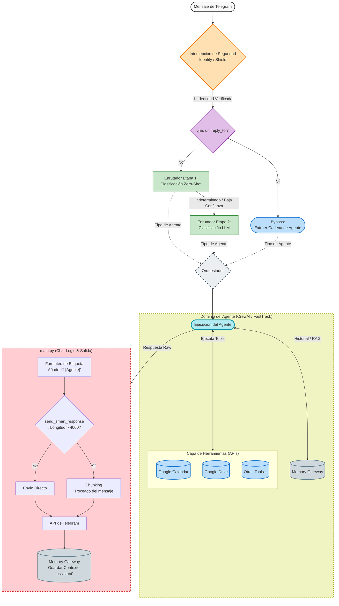

# Full message flow diagram

# Architecture Analysis: Routing and Output Architecture Review (LifeOS)

## 1. The "As-Is" Snapshot (Current State)
The current system features a well-defined, stratified input architecture but experiences a bottleneck in responsibility delegation during the execution and output phases.

The lifecycle of a message currently follows this flow:
1. **Boundary:** Telegram -> `main.py`.
2. **Security:** `SocialShield` and `IdentityManager` filter incoming requests and manage access control.
3. **Smart Routing:** A two-stage routing system (Zero-Shot classification with an LLM Fallback) featuring a fast-track bypass for thread replies.
4. **Execution:** An orchestrator instantiates the designated Agent, granting it access to the `Memory Gateway` and external API tools (e.g., Calendar, Drive).
5. **Output Processing:** The raw response is returned to `main.py`, which assumes the responsibility of message formatting, handling network infrastructure constraints (Telegram chunking), and consolidating short-term memory.

## 2. Critical Architectural Areas for Improvement

Mapping the system visually has highlighted several design patterns that introduce technical debt, primarily concentrated within the main controller:

### A. Overloaded Main Controller (`main.py`)
The `main.py` file currently acts beyond its intended scope as a simple bridge between the web API and the core system. It absorbs significant business logic, including:
* Injecting formatting strings (hardcoding agent identification tags).
* Implementing rudimentary pagination and chunking algorithms to accommodate Telegram's 4096-character limit.
* Directly handling database write operations for memory persistence.

### B. Separation of Concerns Violation in Memory Gateway
The `Memory Gateway` is being utilized across two distinct operational domains, leading to an inconsistent data flow:
1. **Reading:** The Agent uses the gateway autonomously to fetch context (RAG, conversational history).
2. **Writing:** `main.py` forcefully invokes the gateway at the end of the execution script to save the assistant's response.
*Consequence:* The Agent lacks full ownership of its execution lifecycle. It does not internally register its final response to the user; rather, it relies on an external script to persist its state.

### C. State Loss on Network Failure
Due to the sequential design in `main.py`, the persistence of the assistant's memory occurs **strictly after** attempting to dispatch the message via the Telegram API. If the network request times out or the proxy fails, the Agent has already consumed computational resources and potentially executed external tools (e.g., creating a Calendar event), but **the system will fail to record the interaction**. This architecture guarantees context loss and potential AI hallucinations in subsequent interactions.

### D. Presentation Layer Coupling
The requirement for `main.py` to calculate string slicing to prevent Telegram API errors indicates that the application layer is tightly coupled to the physical limitations of a specific user interface. If the system is integrated with alternative platforms (e.g., WhatsApp, web terminals) in the future, this logic will require duplication or significant refactoring.

## 3. Strategic Refactoring Initiatives

For future iterations or system redesigns, the following architectural principles are recommended:

1. **Inversion of Control for State Persistence:** The Orchestrator or the Agent module must persist its generated response in the `Memory Gateway` *before* relinquishing control to the network layer. This ensures accurate state tracking regardless of network stability.
2. **Dedicated Presentation Layer:** Extract all chunking, pagination, and Markdown formatting logic into a dedicated adapter module (e.g., `TelegramAdapter` or `ViewHandler`).
3. **Controller Slimming:** `main.py` should be strictly limited to receiving incoming requests, passing them to the routing layer, receiving a finalized response object, and dispatching it to the output adapter. It should be stripped of all core business logic.
