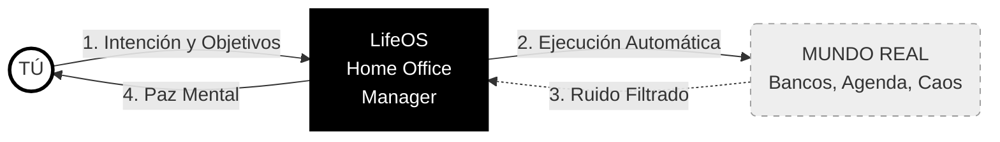

# LifeOS v2: Vision Document
**"The Operating System for Personal Sovereignty"**

| Metadata | Detail |
| :--- | :--- |
| **Version** | 3.0 (The North Star) |
| **Scope** | Aspirational / Strategic |
| **Horizon** | 3 - 5 Years |

---

## 1. The Business Opportunity (The Problem)

### 1.1 The Context
We live in an attention economy designed to fragment concentration and extract behavioral data. Current productivity tools (SaaS) have perverse incentives:
1.  **Data Lock-in:** Your memories, notes, and schedule are held hostage in closed silos (Notion, Google, Apple).
2.  **Optimization for Engagement:** Apps want you to spend time *organizing* them, not executing.
3.  **Lack of Alignment:** A generic assistant (ChatGPT/Siri) serves the "average", not *your* specific goals. It won't scold you if you fail because it is programmed to be compliant, not effective.

### 1.2 Problem Statement
**The modern individual lacks the necessary cognitive infrastructure to compete with organizations and algorithms.** Without an external system that reinforces discipline, remembers context, and automates bureaucracy, the individual loses their **Agency**.

---

## 2. Product Vision Statement

### 2.1 Who It Is For
For individuals seeking to **regain full control over their time, data, and behavior**, rejecting the "digital serfdom" of Big Tech platforms.

### 2.2 What Is LifeOS (The Optimal Goal)
LifeOS is a **Sovereign Exocortex**.
It is a digital extension of the user's mind that resides on self-owned infrastructure. Unlike commercial assistants, LifeOS **is not a product; it is a digital employee loyal exclusively to its owner**.

Its ultimate goal is to **eliminate the friction between Intention and Action**.
* *If you think "I want to be healthy," LifeOS manages the groceries, the diet, and blocks the schedule for the gym.*
* *If you decide "I want no distractions," LifeOS acts as an aggressive firewall against the outside world.*

---

## 3. Strategic Capabilities (The Ideal Features)

These are the capabilities the system *must eventually possess* to fulfill its vision, beyond today's code limitations.

### 3.1 Invisible Omnipresence (Zero-UI)
The optimal goal is for the interface to disappear.
* **Today:** Chat on Telegram.
* **Vision:** The system passively "listens" and "sees" (via wearables, secure ambient microphones). It understands context without explicit commands. If you walk into the kitchen, the *Kitchen* agent already knows what ingredients are missing without you asking.

### 3.2 Infinite and Perfect Memory (Total Recall)
The system must act as a real-time biographer.
* **Vision:** Not just remembering data, but **synthesizing wisdom**. The system should be able to answer: *"Based on your journals from the last 5 years, you tend to get depressed in November. I have booked preventive therapy and purchased Vitamin D."*
* **Sovereignty:** This biographical database (vector) lives on a physical hard drive in the user's home, encrypted. It never trains public models.

### 3.3 Programmable Psychology (Morphological Personality)
The user must be able to "program their own superego."
* **Vision:** The system adapts its psychological personality to the need of the moment. It can be a **Compassionate Therapist** on Tuesday night and a **War General** on Wednesday morning. The user defines the rules of engagement ("Don't let me cancel tasks due to tiredness") and the system enforces them without mercy.

### 3.4 Autonomous Agents with "Skin in the Game"
Agents cease to be passive chatbots and become actors with real permissions.
* **Vision:** The *Finance* agent doesn't "suggest" you save. It has read/write permission on the bank account to move money to investment accounts automatically or block the credit card if it detects an impulsive spending pattern (according to pre-approved rules).

---

## 4. Conceptual Architecture (The Foundation)

To support this vision, the technical architecture must adhere to non-negotiable principles:

1.  **Local-First, Cloud-Optional:** The system must be functional without the internet. Intelligence (LLM) must be able to degrade to local models (Llama/Mistral) if the cloud goes down or for extreme privacy.
2.  **Model Agnosticism:** "Intelligence" is a commodity. LifeOS is the chassis; the engine (GPT-6, Claude 5, Gemini) is swapped for the highest bidder or highest efficiency.
3.  **Extreme Modularity:** Each vital function (Health, Finance, Agenda) is an isolated microservice. If the Finance module fails, it does not affect the Health module.

---

## 5. Success Criteria (The Definition of Done)

We will know the vision has been achieved when:
1.  **Blind Trust:** The user can say "Handle organizing the birthday party" and completely disengage, knowing the system will execute invitations, purchases, and scheduling without errors.
2.  **Cognitive Load Reduction:** The user reports a 90% reduction in "mental noise" (remembering tasks, anxiety about forgetting things).
3.  **Invisibility:** The user spends more time *living* and less time *configuring LifeOS*.