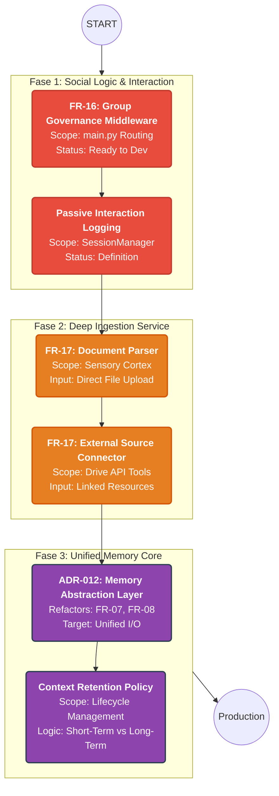

# 🔥 LifeOS v2 — Personal Governance OS (Status: Active Development)

**Última actualización:** 2026-02-03

**LifeOS** es un sistema de gobernanza personal basado en agentes autónomos (**CrewAI**) que ayudan a convertir intención en acción. No es un simple chatbot: es una arquitectura modular, autoalojada y orientada a privacidad que combina **enrutamiento de agentes**, **memoria dual (sesiones + vector DB)** y un **proxy de LLMs (LiteLLM)** para trabajar con modelos multimodales de forma segura y sustituible.

---

## 🚀 Novedades (Feb 2026)
- ✅ **Sensory Cortex (Multimodal)**: Soporte para **imágenes** (passthrough visual) y **notas de voz** (normalización + transcripción). Los inputs no textuales se procesan en `src/sensory` y se entregan a los agentes en un formato multimodal estándar.
- ✅ **Two-Speed / Fast Track**: Canal "rápido" para intents simples (FastTrack agents) y canal "profundo" para razonamiento costoso. Implementado en `src/fast_agents.py` y `src/crew_orchestrator.py`.
- ✅ **Proxy de LLMs (LiteLLM)** y **Memoria Semántica (Qdrant)** funcionando (configurable en `litellm_config.yaml`).

---

## 🏗️ Arquitectura y Conceptos Clave

- **CrewAI (Agents):** Agentes especializados declarados en `src/config/agents.yaml`. Cada agente tiene personalidad, herramientas y objetivos.
- **LiteLLM Proxy:** Abstracción para cambiar proveedores de modelo con una configuración central.
- **Memoria Dual:** `sessions.json` para contexto conversacional y **Qdrant** para memoria vectorial a largo plazo.
- **Identidad / RBAC:** `IdentityManager` protege la entrada y asigna roles (`ADMIN`, `FAMILY`, `GUEST`).
- **Sensory Cortex:** Middleware (`src/sensory/cortex.py`) que enruta `photo` y `voice` a drivers especializados (`VisualDriver`, `AudioDriver`).

---

## 🧩 Implementación de Multimodal (Detalles Técnicos)
- **Visual (Photos):** `VisualDriver` optimiza la imagen (resize + JPEG) y la codifica en Base64 para generar un payload multimodal compatible con LLMs modernos.
- **Audio (Voice Notes):** `AudioDriver` normaliza audio (OGG -> MP3 via `pydub`/FFmpeg), envía a un pool de transcripción (`audio-model`) y retorna la transcripción en texto para su procesamiento.
- **Routing:** La Dispatcher puede ser multimodal; por ejemplo, una foto del refrigerador se enruta al agente `Kitchen`.

> Tip: Para probar localmente, envía una foto o una nota de voz al bot en Telegram. Las notas de voz se transcriben y llegan como texto; las fotos llegan como payload multimodal.

---

## ✅ Requisitos e Instalación

### Requisitos del sistema
- Docker & Docker Compose (opcional para despliegue). 
- **FFmpeg** (requerido para normalizar audio). En Windows puedes instalarlo por choco o descargar binarios:
  - Chocolatey: `choco install ffmpeg`
  - Descargar desde https://ffmpeg.org/

### Python deps
```bash
python -m venv .venv
.venv\Scripts\activate  # Windows
pip install -r requirements.txt
```

> Nota: `pydub` requiere FFmpeg en PATH.

### Configuración mínima
- Crea `.env` con tus credenciales (ej. `GEMINI_API_KEY`, `TELEGRAM_TOKEN`).
- Añade `src/config/users.json` para los roles (o usa `users.json` en la raíz si prefieres).

### Levantar localmente (Docker)
```bash
docker-compose up -d --build
```

Logs útiles:
```bash
docker-compose logs -f lifeos
```

---

## 📂 Estructura del Proyecto (rápida)
```
lifeOS/
├── data/                  # Qdrant, sessions.json
├── docs/                  # Vision, PRD, ADRs
├── docker-compose.yml
├── litellm_config.yaml
├── main.py                # FastAPI + Telegram lifecycle + Sensory registrations
├── src/
│   ├── sensory/           # Sensory Cortex + drivers (visual, audio)
│   ├── crew_orchestrator.py
│   ├── fast_agents.py     # Fast Track agents
│   ├── memory_manager.py  # Qdrant integration
│   └── ...
└── requirements.txt
```

---

## 🛠️ Roadmap (Siguientes implementaciones)


---

## 🔗 Documentación y ADRs
- Vision: `docs/vision-document.md`
- Product Requirements: `docs/product-requirements-document.md`
- ADRs: `docs/adr/00*-*.md` (ej. `011-multimodal-strategy.md`)

---

## ⚠️ Disclaimer
Proyecto personal de ingeniería. Úsalo con precaución y responsabilidad; algunas capacidades planeadas (p.ej. actuadores financieros reales) requieren trabajo extra y validaciones legales antes de otorgar permisos de escritura automáticos.

Built with ❤️ and ☕ by David G. Calles.
